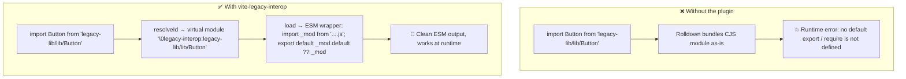

# vite-legacy-interop ⚡

[](https://www.npmjs.com/package/vite-legacy-interop)
[](https://www.npmjs.com/package/vite-legacy-interop)
[](https://github.com/ElJijuna/vite-legacy-interop/blob/main/LICENSE)
[](https://github.com/ElJijuna/vite-legacy-interop/actions/workflows/publish.yml)

> A Vite plugin that wraps legacy CJS subpath imports in ESM-compatible virtual modules, preventing CommonJS interop errors at runtime with Rolldown.

---

## 🧩 The problem this solves

When building a library with Vite 8 that consumes a legacy CJS package via subpath imports (`legacy-lib/lib/Button`), Rolldown can produce invalid output that breaks at runtime:

```
SyntaxError: The requested module 'legacy-lib/lib/Button' does not provide an export named 'default'
```

or worse:

```
ReferenceError: require is not defined
```

This happens because the legacy package exposes CommonJS modules under a `lib/` folder (e.g. `legacy-lib/lib/Button.js`) and Rolldown does not perform the CJS→ESM interop needed to consume them cleanly.

`vite-legacy-interop` intercepts those subpath imports and replaces them with virtual ESM modules that handle the interop layer transparently:



---

## 📦 Installation

```bash
npm install -D vite-legacy-interop
```

---

## 🚀 Usage

```ts
// vite.config.ts
import { defineConfig } from 'vite'
import { legacyInterop } from 'vite-legacy-interop'

export default defineConfig({
  plugins: [
    legacyInterop({
      libs: ['legacy-lib'],
    }),
  ],
})
```

### Custom `libDir`

If your legacy package exposes modules under a folder other than `lib/`:

```ts
legacyInterop({
  libs: [{ name: 'legacy-lib', libDir: 'dist' }],
})
```

### Multiple libraries

Mix string shorthand and full config objects freely:

```ts
legacyInterop({
  libs: [
    'leg-libl',
    { name: 'another-legacy-lib', libDir: 'dist' },
  ],
})
```

### Nested subpaths

Works out of the box — the plugin scans recursively:

```ts
import Column from 'legacy-lib/lib/Grid/Column'
import Row    from 'legacy-lib/lib/Grid/Row'
```

### Debug logging

```ts
legacyInterop({
  libs: ['legacy-lib'],
  showLog: true,
})
```

Output:

```
[vite-legacy-interop] Resolving: legacy-lib/lib/Button
[vite-legacy-interop] Resolving: legacy-lib/lib/Grid/Column
```

### Limit to build or serve

Use `apply` to restrict the plugin to a specific Vite phase:

```ts
legacyInterop({
  libs: ['legacy-lib'],
  apply: 'build', // or 'serve'
})
```

When omitted, the plugin runs during both build and serve (Vite default).

---

## ⚙️ Options

| Option | Type | Required | Default | Description |
|---|---|---|---|---|
| `libs` | `(string \| LibConfig)[]` | Yes | — | Libraries to intercept. Empty strings are ignored. At least one valid entry is required. |
| `showLog` | `boolean` | No | `false` | Logs each resolved import path to the console. |
| `apply` | `'build' \| 'serve'` | No | both | Restricts the plugin to the build or serve phase only. |

### `LibConfig`

| Property | Type | Required | Default | Description |
|---|---|---|---|---|
| `name` | `string` | Yes | — | Package name as it appears in import statements. |
| `libDir` | `string` | No | `'lib'` | Subfolder inside the package to scan for modules. |

---

## 🔍 How it works

At startup, the plugin scans the `libDir` folder of each configured package and builds a `Set` of available modules (recursively, supporting nested paths). At build time it hooks into two Vite phases:

1. **`resolveId` (`enforce: 'pre'`)** — intercepts any import matching `<lib>/<libDir>/<path>`. If the module exists in the `Set`, returns a virtual module ID. If not, emits a warning and lets Vite handle it normally.

2. **`load`** — receives the virtual ID and returns an ESM wrapper:

```ts
import * as _modNs from '/absolute/path/to/legacy-lib/lib/Button.js';
const _mod = 'default' in _modNs ? _modNs.default : _modNs;
const _default = _mod && _mod.__esModule && 'default' in _mod ? _mod.default : _mod;
export default _default;
```

Using a namespace import (`import * as`) avoids the _"does not provide an export named 'default'"_ error that Rolldown throws when a CJS module has no explicit default export. The wrapper then normalises the value regardless of whether the original module uses `module.exports`, `exports.default`, or `__esModule` interop.

---

## 🤔 When to use this vs `vite-legacy-pass-through`

| Scenario | Plugin |
|---|---|
| Legacy lib will be available at runtime — you don't need to bundle it | [`vite-legacy-pass-through`](https://www.npmjs.com/package/vite-legacy-pass-through) |
| Legacy lib must be included in the bundle but causes CJS/ESM interop errors | `vite-legacy-interop` |

---

## 📋 Requirements

- **Vite**: `^8.0.0`
- **Node.js**: `>=18`

---

## 📄 License

MIT
